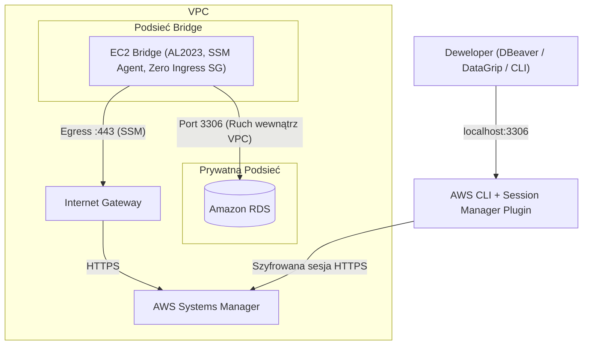

# AWS RDS Secure Bridge (Zero-Trust SSM Tunnel)

Lekkie, bezserwerowe i zgodne z architekturą Zero-Trust rozwiązanie w Terraformie do bezpiecznego tunelowania połączeń z lokalnej stacji roboczej do bazy danych Amazon RDS w prywatnej podsieci. Zastępuje tradycyjny bastion SSH szyfrowanym kanałem AWS Systems Manager (SSM) Session Manager bez otwierania jakichkolwiek portów przychodzących (brak portu 22) i bez zarządzania kluczami SSH.

---

## Komponenty architektury

1. **Instancja Bridge EC2 (SSM Bridge):**
   * Lekka instancja EC2 w architekturze x86_64 (`t3.micro` / `t3.nano`) oparta o oficjalny system Amazon Linux 2023.
   * Działa w dedykowanej podsieci w istniejącym VPC i realizuje wyłącznie ruch wychodzący kontrolowany przez agenta AWS Systems Manager.

2. **Zero-Trust Security Group:**
   * **Brak reguł przychodzących (`ingress = []`):** Żaden port sieciowy (w tym port 22 SSH) nie jest wystawiony na świat zewnętrzny ani nasłuchiwany z internetu.
   * **Ruch wychodzący (Egress):** Ograniczony do portu HTTPS (443) na potrzeby komunikacji z AWS Systems Manager, portu bazy danych (`3306` dla MySQL / `5432` dla PostgreSQL) oraz portu HTTP (80) na potrzeby aktualizacji pakietów systemu operacyjnego.

3. **Rola i Profil IAM (Least Privilege):**
   * Instancja EC2 posiada przypisaną dedykowaną rolę IAM z oficjalną polisą `AmazonSSMManagedInstanceCore`.
   * Brak długoterminowych poświadczeń (kluczy dostępowych) – autoryzacja sesji bazuje wyłącznie na uprawnieniach tożsamości AWS IAM / AWS SSO administratora.

4. **Dynamiczna integracja z bazą RDS:**
   * Terraform automatycznie dodaje regułę zezwalającą na ruch przychodzący w istniejącej Security Group bazy danych RDS wyłącznie z grupy zabezpieczeń instancji bridge.

---

## Schemat Połączeń Sieciowych



---

## Decyzje architektoniczne i bezpieczeństwo

### 1. Eliminacja portu 22 i bastiona SSH na rzecz AWS SSM Session Manager
* **Jak było:** Instancja posiadała otwarty port 22 (SSH) w Security Group na świat lub określony adres IP, a dostęp wymagał generowania par kluczy SSH (`.pem`) i przekazywania parametru `key_name`.
* **Dlaczego zmieniono:** Otwarty port 22 to wektor podatny na skanowanie sieci i ataki brute-force. Zarządzanie kluczami SSH rodzi ryzyko wycieku sekretów, utrudnia rotację i nie zapewnia audytu operacji.
* **Co zrobiono:** Zastosowano architekturę Zero-Trust. Security Group mostu ma całkowicie zablokowany ruch przychodzący (`ingress = []`). Połączenie z bazą tunelowane jest przez bezpieczny kanał AWS SSM Session Manager na podstawie uprawnień IAM.

### 2. Zachowanie architektury x86_64 i dynamiczny dobór obrazu Amazon Linux 2023
* **Jak było:** W konfiguracji znajdował się zahardkodowany identyfikator AMI (`ami-00a929b66ed6e0de6`) ze starego systemu Amazon Linux 2, działający wyłącznie w jednym regionie (`us-east-1`).
* **Dlaczego zmieniono:** Sztywny identyfikator AMI uniemożliwiał wdrożenie w innych regionach (np. `eu-central-1`) oraz blokował aktualizacje bezpieczeństwa.
* **Co zrobiono:** Wdrożono dynamiczne źródło danych `aws_ami` wyszukujące najnowszy oficjalny obraz Amazon Linux 2023 dla architektury x86_64. Jako domyślny typ instancji wybrano `t3.micro`.

### 3. Wykorzystanie istniejącego Internet Gateway (Data Source)
* **Jak było:** Konfiguracja bezwarunkowo tworzyła nowy zasób `aws_internet_gateway` w podanym VPC.
* **Dlaczego zmieniono:** W chmurze AWS do jednego VPC może być przypisany tylko jeden Internet Gateway. Skoro baza RDS działa w istniejącym VPC, próba utworzenia kolejnej bramy powodowała błąd kolizji (`ConflictException`).
* **Co zrobiono:** Zastosowano proste źródło danych `data "aws_internet_gateway" "existing"`, które pobiera identyfikator bramy już działającej w VPC i bezpiecznie podpina pod nią tabelę routingu naszej podsieci.

---

## Uruchomienie

### Wymagania wstępne:
* [Terraform](https://developer.hashicorp.com/terraform/downloads) >= 1.5.0
* [AWS CLI](https://aws.amazon.com/cli/) skonfigurowane z uprawnieniami do zarządzania EC2, VPC i IAM
* [Session Manager Plugin](https://docs.aws.amazon.com/systems-manager/latest/userguide/session-manager-working-with-install-plugin.html) zainstalowany lokalnie dla AWS CLI

### 1. Konfiguracja zmiennych:
Skopiuj plik przykładowy i uzupełnij identyfikatory swojego środowiska:

```bash
cd terraform
cp terraform.tfvars.example terraform.tfvars
```

Edytuj `terraform.tfvars`, podając ID swojego VPC, Security Group bazy RDS oraz endpoint RDS:
```hcl
vpc_id                = "vpc-0123456789abcdef0"
rds_security_group_id = "sg-0123456789abcdef0"
rds_endpoint          = "mydb.c123456789.us-east-1.rds.amazonaws.com"
```

### 2. Wdrożenie infrastruktury:
```bash
terraform init
terraform apply
```

Po zakończeniu wdrożenia Terraform wyświetli gotowe polecenie do zestawienia tunelu SSM.

### 3. Zestawienie bezpiecznego tunelu SSM:
Uruchom w osobnym terminalu polecenie wygenerowane w outputach Terraform:

```bash
aws ssm start-session \
  --target <INSTANCE_ID> \
  --document-name AWS-StartPortForwardingSessionToRemoteHost \
  --parameters '{"host":["<RDS_ENDPOINT>"],"portNumber":["3306"],"localPortNumber":["3306"]}'
```

Po uruchomieniu sesja nasłuchuje na Twoim lokalnym porcie `3306` i bezpiecznie przekazuje pakiety do prywatnej bazy RDS.

### 4. Połączenie z bazą danych:
W ulubionym kliencie SQL (np. DBeaver, DataGrip) skonfiguruj połączenie z parametrami:
* **Host:** `127.0.0.1` (lub `localhost`)
* **Port:** `3306`
* **Użytkownik i hasło:** poświadczenia Twojej bazy RDS

Lub bezpośrednio z terminala:
```bash
mysql -h 127.0.0.1 -P 3306 -u <db_user> -p
```

### 5. Sprzątanie środowiska:
Aby usunąć instancję bridge i powiązane zasoby, wykonaj:

```bash
terraform destroy
```

---

## Struktura projektu

```text
.
├── .github/
│   └── workflows/
│       └── terraform.yml       # Automatyczna walidacja formatu i poprawności w CI
├── terraform/
│   ├── main.tf                 # Zasoby sieciowe, podsieć, routing i instancja EC2 (AL2023 x86_64)
│   ├── iam.tf                  # Rola IAM, polisa SSM Managed Core i profil instancji
│   ├── security_groups.tf      # Reguły Zero-Trust SG dla bridge oraz reguła ingress dla RDS
│   ├── variables.tf            # Deklaracja zmiennych konfiguracyjnych z opisami
│   ├── outputs.tf              # Identyfikatory zasobów i wygenerowane komendy połączeń SSM
│   ├── versions.tf             # Wymagania wersji Terraform i providera AWS
│   ├── user_data.sh            # Skrypt inicjalizacyjny dla instancji (narzędzia diagnostyczne)
│   └── terraform.tfvars.example# Wzorcowy plik zmiennych konfiguracyjnych
├── .gitignore                  # Ochrona przed commitowaniem plików stanu i sekretów
└── README.md                   # Dokumentacja techniczna projektu
```
